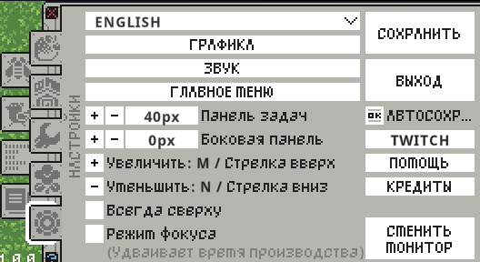
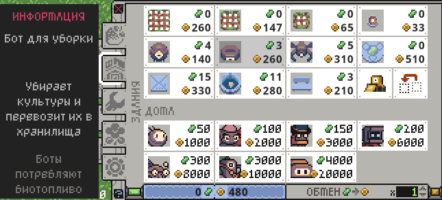
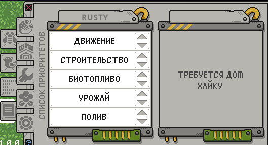
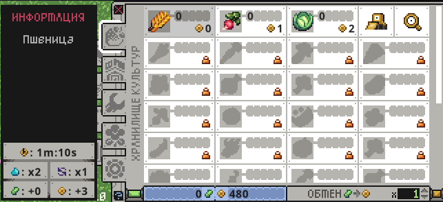

# Русификатор

Этот репозиторий содержит русификатор для игры **Rusty's Retirement**.

## Установка

1. **Скачать файл Assembly-CSharp.dll**

2. **Заменить файл в папке \Rusty's Retirement_Data\Managed\\**

3. **Запустить игру!**

## Перевод

Перевод игры на русский язык осуществлен при помощи языковой модели OpenAI, ChatGPT.

## Virustotal

[Отчет о сканировании на VirusTotal (0/64)](https://www.virustotal.com/gui/file/3b95dabb0349a1a6b930e0efb4390d08de5e55ac71bec1c3bebb1a3d07c1fc40?nocache=1)

## Скриншоты

## Отказ от ответственности

Использование данного русификатора осуществляется на ваш риск. Автор не несет ответственности за любые возможные последствия использования данного русификатора, включая, но не ограничиваясь, проблемами с производительностью игры, потерей сохраненных данных, конфликтами с другими модификациями или любыми другими негативными последствиями. Пожалуйста, перед установкой русификатора сделайте резервную копию важных файлов и сохранений игры.

---

Если у вас возникли какие-либо проблемы или есть предложения, пожалуйста, создайте issue или pull request. Наслаждайтесь игрой на русском языке!

